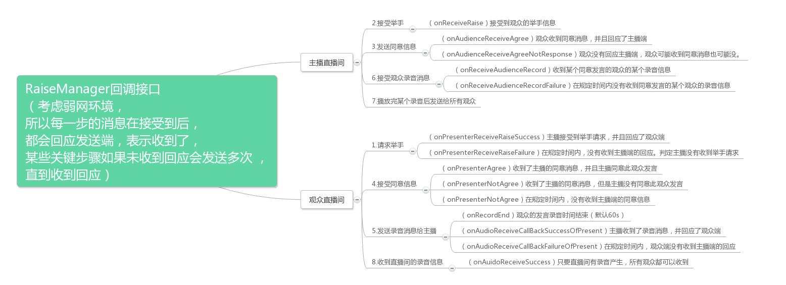

# RaiseManagerSDK 
智播项目,教育类应用场景之举手发言,依赖于[直播SDK](https://github.com/Jungle68/ZBSmartLiveSDK/wiki/智播云通讯文档说明#2-直播间)
## 举手发言需求 

1. 观众端发送im消息向主播端请求举手

2. 主播端同意某观众的举手后,在观众响应之前不的同意其他用户举手，并且每个请求10s后消失

3. 观众端收到主播的同意请求后，开始录制语音，录制成功后上传给服务器，并用im消息发送给主播端，60s内可发送多次
4. 主播收到im消息后,添加到语音列表,请求im消息中附带的录音url,下载录音并播放,播放完成后推送给所有观众,观众收到im消息后添加到各自的语音列表,观众点击播放才开始下载并拨佛

## 举手发言SDK须知
1. **SDK**主要由``RaiseManager``作为统一接口，因为此场景会用到录音，并且其他地方也会用到，``AudioManager``作为一个辅助并且独立(与``AudioManager``不会有任何耦合)的管理类专门负责语音的逻辑

2. 举手发言的需求仅仅是一个现在的需求，此**SDK**不会只局限于此需求,提供了强大于当前需求的功能,比如,支持多人举手,多人多语音发言,主播端能定位到某个观众某条语音是否发送成功,定制开发时千万不要局限于当前需求,开发者可以在上面扩展更多需求
3. ``RaiseManager``使用``builder``模式,可随意扩展更多参数,控制构造过程

4. 此**SDK**为了扩展，让开发者有更多选择权，所以有很多地方没有高度封装，但为了快速集成当前需求，在**ext**包中提供了当前需求的一些快速实现，可以仿照实现，自定义一些其他需求的实现

## 举手发言sdk用法
### RaiseManager（主要）
#### 参数及方法介绍: 
> 构造时需要传入的参数
> > 必要参数
> > >**Context** 上下文  
> > >**Cid**: 直播间的会话id   
> > >**Usid**: 用来表示用户的唯一码  
> > >**AudioManager**: 用来操作语音相关逻辑的管理类  
 
> > 非必要参数
> > >**PresenterLisenter**: 与主播端逻辑有关联的所有回调，可在回调中实现主播在当前情况下的逻辑或`ui`处理  
> > >**AudienceLisenter**: 与观众端有关联的所有回调，可在回调中实现主播在当前情况下的逻辑或`ui`处理
> > >**AudioStatuListener**: 观众端的与语音信息有关的回调，可在回调中实现主播在当前情况下的逻辑或`ui`处理  
> > >**RaiseTimeout**: 举手超时时间，如果观众端在该超时时间内没有收到主播端的任何消息，即判定超时，可在回调中做相应逻辑，默认为**10s**  
> > >**AgreeTimeout**: 主播同意超时时间，在主播端收到举手消息后，在该超时时间内没有答复观众端同意或拒绝则判定为超时，可在回调中做相应逻辑，默认为**10s**  
> > >**RecordTime**: 观众端在举手成功后，录音发言的最大时间，在此时间内才可录音发言，超过此时间判定为超时，可在回调中做相应的逻辑，默认为**60s**  

> 公有方法
> > 普通的方法  
> > >**raise**: 观众端向主播端举手  
> > >**sendAgreeMessage**: 主播端向观众端发送同意消息
> > >**sendRecordMessageToPresenter**: 向主播端发送录音消息  
> > >**sendRecordMessageToAll**: 向直播间所有观众发送录音消息  
> > >**handleMessage**: 统一接收所有与举手发言有关的消息，与`ImSDK`的回调结合使用  
> > >**release**: 释放资源
  
> > 与录音相关的方法
> > >**startRecord**: 开始录制语音  
> > >**stopRecord**: 停止录制语音,如果录制成功则上传服务器    
> > >**cancelRecord**: 取消录音语音
> > >**isRecording**: 是否正在录制语音

#### 方法调用时序图:

#### 代码示例:
     
     RaiseManager.Builder builder = (RaiseManager.Builder) EducationSdk.getInstance().getManger(EducationSdk.MANAGER_RAISE);
        mRaiseManager = builder
                .with(getActivity())
                .cid(mCid)
                .usid(BaseApplication.userInfo.usid)
                .audio(mAudioManager)
                .addAudienceLisenter(mAudienceLisenter)
                .addAudioStatuListener(mAudioStatuListener)
                .addPresenterLisenter(mPresenterLisenter)
                .build();

### AudioManager（辅助）
####Dev tips
* `AudioManager`独立于举手发言场景，它不与举手发言场景耦合，唯一与举手场景耦合的地方时录音结束后发送消息给主播，每个场景发送的逻辑不一样，所以采用接口的方式(post interface)，让调用者实现，此场景下由`RaiseManager`实现.

* 因为录音相关逻辑涉及到上传和下载的功能，`AudioManager`专注于录音处理，由于网络框架每个项目都有自己独有的一套，且庞大，所以调用者通过`HttpHelper`接口，自己实现上传下载的功能,这样保证了扩展又保证了**SDK**的大小.
* `AudioInfo`表示录音的消息，里面封装有基本的信息，在`RaiseManager`回调中经常出现，为了扩展，`AudioManager`可以传入一个继承于`AudioInfo`的范型，这样就可以在回调中收到自己定义的录音消息对象，可以储存一些自己定义的信息.

####AudioInfo structure 

Field       | Description
:----------:|:-------------:
filePath    | 录音文件本地路径
url         | 上传到服务器的url地址
recordTime  | 录制的时间单位秒
ctime       | 创建的时间单位毫秒，作为此录音的唯一码
status      | 0.正常状态 1.下载中 2.播放失败 3.播放中 4.播放暂停

#### ★详情请查看[`AudioManager`文档](https://github.com/JessYanCoding/AudioManagerSDK)         
